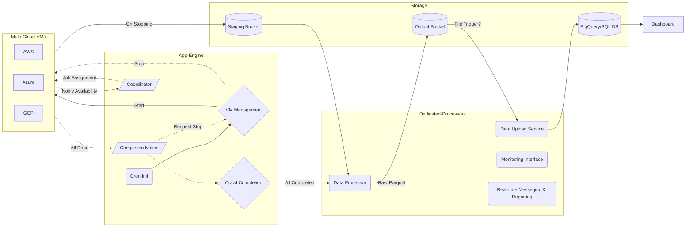

# yCrawl
My Web Crawl is a collection of daily-repetitive web scrapping tasks. Main language is `python` (main) and `node.js` (for puppeteer only), and are usually commanded by `bash` scripts for system control.

For monitoring, use dedicated server is better than GAE.

## Roles & Modules

The folder structure is organized according to roles. Root folder is intended for frontend use with Coordinator and is coded with compatibility of App Engine. Subfolder Worker and DataProcessor shall be deployed separately as simple scipt.

__Frontend__ acts as Flask app, which further includes templates folder. No static folder/content is severed here.

__Coordinator__ is in charge of distributing tasks and monitoring completion status. Coordinator can be a standalone micro-service, but is currently served by Frontend mostly.

__Worker__ is a virtual machine (or container) to actually do the job. To simplify process, a worker will only call `main.py` and subsequently calling node and python modules. Cloud interface is achieve directly in `gsutil` bash for better performance.

__DataProcessor__ is the pipeline to perform ETL. Dedicated Spot instance with montioring agent installed.

__Messenger__ is webhook service, only for VM/local version, not in GAE

## Frontend Coordinator

Stop signal includes Spot Instance interruption (Preemptible Notice), VM manager stop and manual stop. Spot instance should have sufficient time to complete the upload job when interrupted by platform; the stop service is registered in each Worker and is fail-safe.


### VM Manager and Status

There are huge differences among cloud services for VM status. "Terminated" for GCP, "Stopped/Deallocated" for Azure, "Stopped" for AWs. Special attention for Azure, stopped VM are still chargeable as deallocation is required, while others do not.

### Security Configuration

No environment key required. Secret keys are managed by cloud secret management service, and is centrally managed.

- Cron job header-auth (only allowed by GAE Cron)
- VM control password controlled
- JSON Auth-key checked before accept notice - will move to bearer

## Deployment

In worker, minimal packages are used. For example, GCP operations are hand to gsutil command line. AUTHKEY is managed by Cloud Secret Manager, and registered to system environment dynamically.

### Web Interface Deployment

GAE has only a portion of services available. `main2` is an extension to `main`, where more localized services are included. Local version is to be deployed by `gunicorn`. The file `.gcloudignore` exclude the local versions and relevant code to be deployed in GAE.

Note that GAE does not send any client message. Plotly and pandas are heavy (~200MB) for GAE, and therefore, plots are only available in vm deployment.

### Worker Deployment
- Configure availability, meta-data and API access during creation
- Run `__init__.sh` manually (recommended) or git first and call the sh
- Check path and python3, nodes versions
- Confirm service account rights (bucket, secret accessor)

### Azure disk size concern

Azure defaults Ubuntu image to be at least 30GB, and its managed disk cost is high (HDD charges operation fee). Use this [disk format guide](https://lev-petrushchak.medium.com/how-to-make-azure-ubuntu-linux-image-less-than-32g-in-size-e6d9a3b5f65f) and [Ubuntu official build](https://cloud-images.ubuntu.com/focal/) for customized boot disk. Process recap (Azure CLI cannot install! so, find a linux-vm with large storage >40GB). (1) apt install qemu-utils (2) get official img, link above (3) convert to vpc according to link 1 in two steps (4) upload to azure blob (5) create a disk use the blob. (6) use AZ command to create VM, and update user with SSH. Password login is not allowed.

```
az vm create --resource-group yCrawl \
    --name ycrawl-5r-ie \
    --size Standard_F2s_v2  --location northeurope \
    --os-type linux --attach-os-disk ycrawl-ubuntu8g-ie \
    --priority Spot --eviction-policy Deallocate --max-price 0.019 \
    --public-ip-address-allocation dynamic

az vm user update -u yan -g yCrawl -n ycrawl-5r-ie --ssh-key-value "Copy from Public Key"
```

To cross-reigion copy a disk, follow [Azure Guide](https://docs.microsoft.com/en-us/azure/virtual-machines/windows/disks-upload-vhd-to-managed-disk-powershell).

## Data Management

### Tables

Previous version and "old" data will be sinked to "hotels_p" and "flights_p" and will be partitioned to imporved query performance. "_p" tables will only be queried when checking price history.

- hotels_p is partitioned by hotel and check_in
- flights-p is partitioned by route and ddate

The live table should store data for about 3 months before move to _p tables.

### Beautiful Soup for yCrawl notes

Parse bytes (instead of String) with "html.parser" to avoid excessive speical characters.

Cooked-data is not validated before returing, and will be checked in DataFrame before exploding.

Accor: [ccy, rate_avg] and rate_sum calculated as pre_tax+tax. multiple json, list element.

Four Seasons: [rate_sum] single json, list element.

Hilton: [ccy, rate_sum] single json, list element.

Marriott: [none] multiple json, list element.


