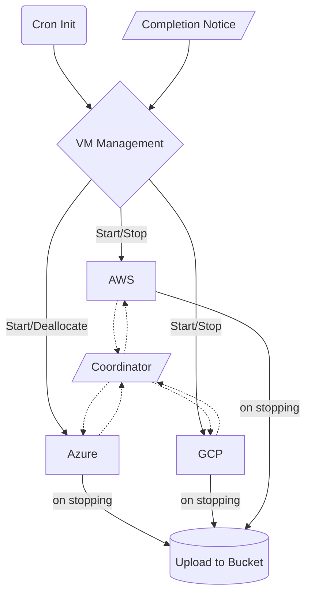

# yCrawl
My Web Crawl is a collection of daily-repetitive web scrapping tasks. Main language is `python` (main) and `node.js` (for puppeteer only), and are usually commanded by `bash` scripts for system control.

## Roles

The folder structure is organized according to roles. Root folder is intended for frontend use with Coordinator and is coded with compatibility of App Engine. Subfolder Worker and DataProcessor shall be deployed separately as simple scipt.

__Frontend__ acts as Flask app, which further includes templates folder. No static folder/content is severed here.

__Coordinator__ is in charge of distributing tasks and monitoring completion status. Coordinator can be a standalone micro-service, but is currently served by Frontend mostly.

__Worker__ is a virtual machine (or container) to actually do the job. To simplify process, a worker will only call `main.py` and subsequently calling node and python modules. Cloud interface is achieve directly in `gsutil` bash for better performance.

__DataProcessor__ is the pipeline to perform ETL.

__Messenger__ is webhook service, only for VM/local version, not in GAE

## Frontend Coordinator

Stop signal includes Spot Instance interruption (Preemptible Notice), VM manager stop and manual stop. Spot instance should have sufficient time to complete the upload job when interrupted by platform; the stop service is registered in each Worker and is fail-safe.

### Security configuration

No environment key required. Secret keys are managed by cloud secret management service, and is centrally managed.

- Cron job header-auth (only allowed by GAE Cron)
- VM control password controlled
- JSON Auth-key checked before accept notice

## Deployment and other concepts

- In worker, minimal packages are used. For example, GCP operations are hand to gsutil command line. AUTHKEY is managed by Cloud Secret Manager, and registered to system environment dynamically.

### Web Interface Deployment

GAE has only a portion of services available. `main2` is an extension to `main`, where more localized services are included. Local version is to be deployed by `gunicorn`. The file `.gcloudignore` exclude the local versions and relevant code to be deployed in GAE.

Note that GAE does not send any message.

### Worker Deployment
- Configure availability, meta-data and API access during creation
- Run `__init__.sh` manually (recommended) or git first and call the sh
- Check path and python3, nodes versions
- Confirm service account rights (bucket, secret accessor)

### Head Server Deployments and Tests

Temporary deployment at fi-server, will be transited to smaller instances.

Workload test is conducted on us-server: small memory is ok, but networking is NOT

### Beautiful Soup for yCrawl notes

Parse bytes (instead of String) with "html.parser" to avoid excessive speical characters.

Cooked-data is not validated before returing, and will be checked in DataFrame before exploding.

Accor: [ccy, rate_avg] and rate_sum calculated as pre_tax+tax. multiple json, list element.

Four Seasons: [rate_sum] single json, list element.

Hilton: [ccy, rate_sum] single json, list element.

Marriott: [] multiple json, list element.

